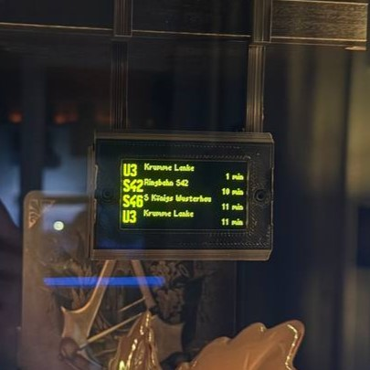
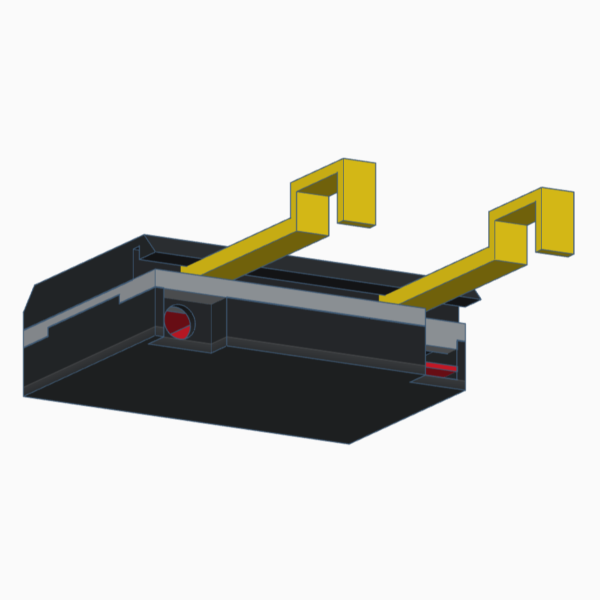
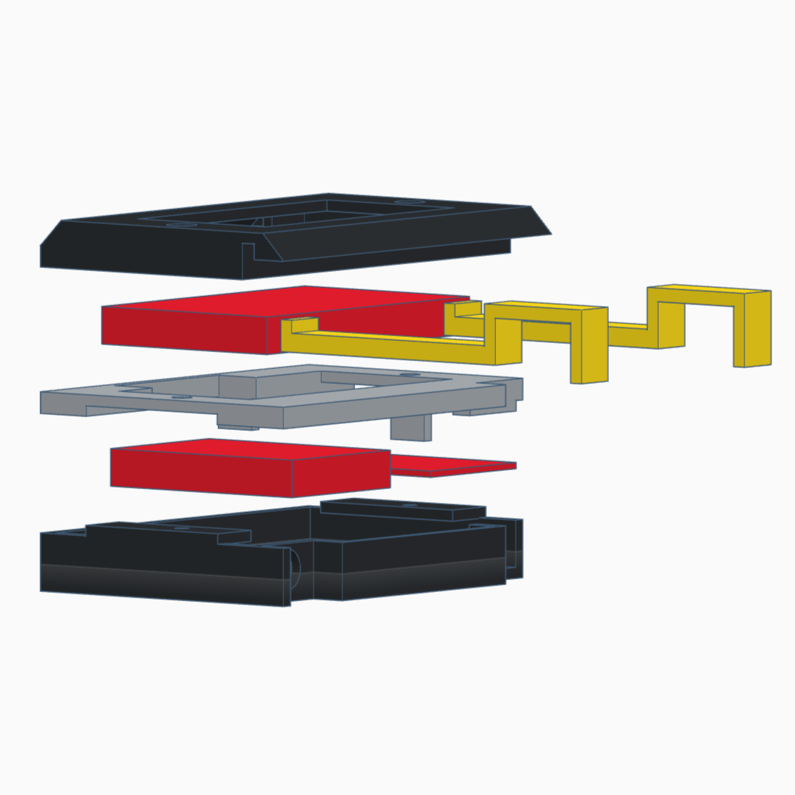

 

  # [miniDAISY](https://github.com/lupoqul/miniDAISY)

  

    a tiny esp32-based BVG-style train information display
     
  

  
Table of Contents

  <ol>
    <li><a href="#about-the-project">About The Project</a></li>
    <li><a href="#hardware">Hardware</a></li>
    <li><a href="#software">Software</a></li>
    <li><a href="#future-goals">Future Goals</a></li>
  </ol>

<!-- ABOUT THE PROJECT -->

## About The Project

Originally, this was a gift for a friend. It closely resembles the train information displays (called DAISY) used by the BVG in Berlin. They show a line number, destination, arrival time and the length of the train. I tried to turn them into a decorative piece. 

(<a href="#readme-top">back to top</a>)

## Software

As an IDE I'm using [Visual Studio Code](https://code.visualstudio.com/) with [PlatformIO IDE](https://platformio.org/platformio-ide). The platformio.ini configuration file is included. It contains a build configuration and the following libraries:

* [bblanchon/ArduinoJson](https://github.com/bblanchon/ArduinoJson)
* [olikraus/U8g2](https://github.com/olikraus/u8g2)
* [rlogiacco/CircularBuffer](https://github.com/rlogiacco/CircularBuffer)

As of now, the train live data is supplied by [v6.vbb.transport.rest](https://v6.vbb.transport.rest/). Unfortunately there is no way to get information about the length or type of train. But it does return the line number, planned and actual time, destination and some more. The esp requests new data every 3min and stores it for the next 12 trains.  

(<a href="#readme-top">back to top</a>)

## Hardware

Its based on an ESP32-board. I've chosen this one, because there is a lipo charger included.

* AZDelivery LOLIN32 Lite Board V1.0
* Waveshare 2.42inch OLED Display Module 128×64
* generic 820mAh li-po battery 44x31mm (polarity was inversed!)

(<a href="#readme-top">back to top</a>)

## Case

I've designed a compact 3d-print case thats made for the specific parts I used. It's made out of 3 parts, 2 optional supports and screwed together with 2x M3x10. All parts were beeing printed on an Ender3 V3 with standard PLA. The stl files are in the case directory. There is a 7mm hole for an on/off switch.

(<a href="#readme-top">back to top</a>)

## Future Goals

As of now, this is just a tiny software project without any testing. Its just a proof of work. Future Goals include:

* code testing
* demo mode without wifi

(<a href="#readme-top">back to top</a>)
